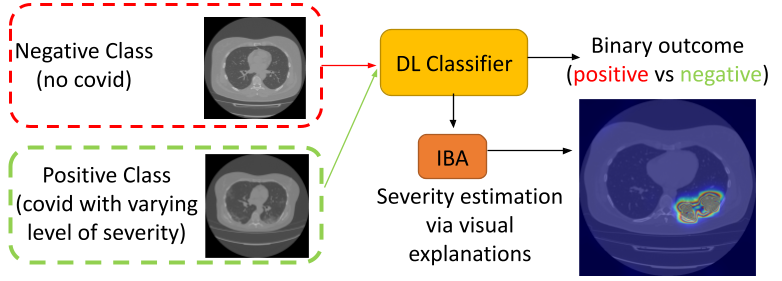
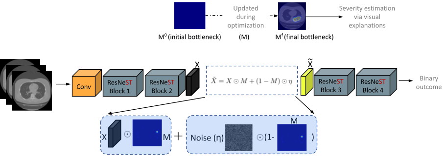
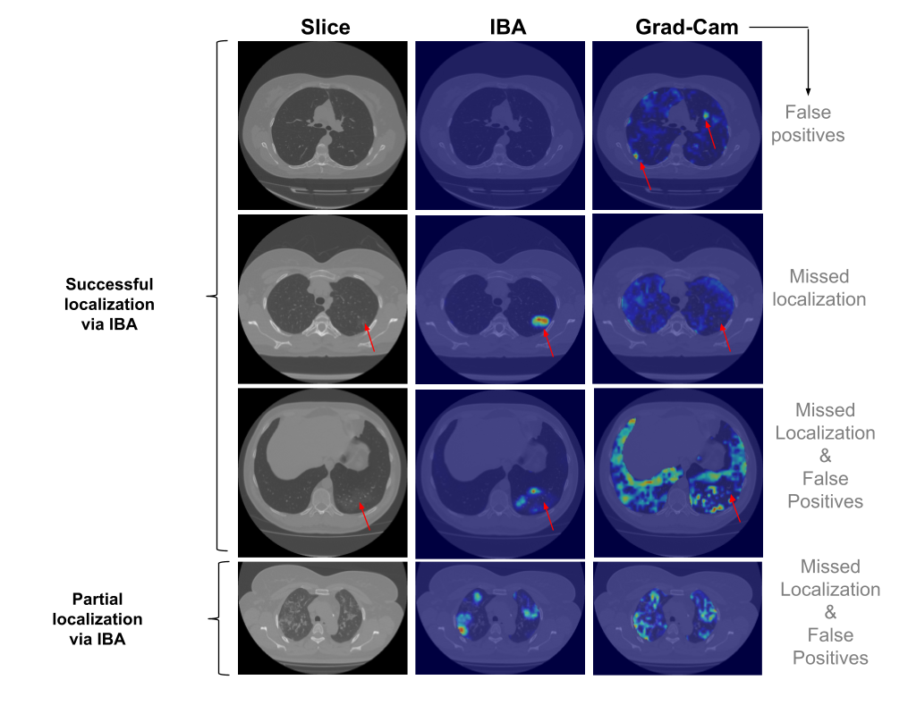
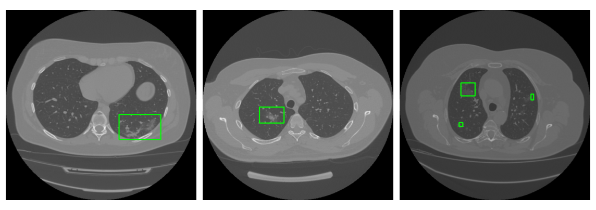
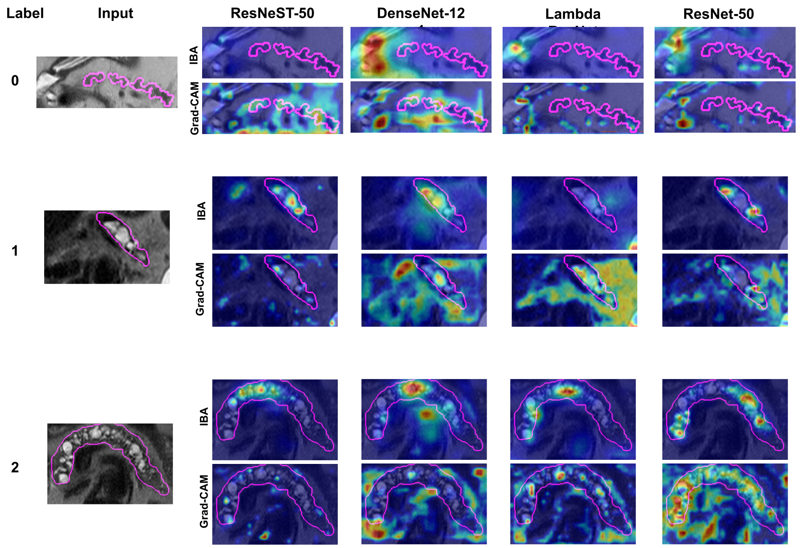

# Information Bottleneck Attribution for Visual Explanations of Diagnosis and Prognosis

[Ugur Demir](https://scholar.google.com/citations?user=Lzxk0PMAAAAJ&hl=en), 
Ismail Irmakci, Elif Keles, Ahmet Topcu, Ziyue Xu, Concetto Spampinato, Sachin Jambawalikar, Evrim Turkbey, Baris Turkbey, [Ulas Bagci](https://bagcilab.com/)

[](https://arxiv.org/abs/2104.02869)

## Overview

### Abstract
Visual explanation methods have an important role in the prognosis of the patients where the annotated data is limited or unavailable. There have been several attempts to use gradient-based attribution methods to localize pathology from medical scans without using segmentation labels. This research direction has been impeded by the lack of robustness and reliability. These methods are highly sensitive to the network parameters. In this study, we introduce a robust visual explanation method to address this problem for medical applications. We provide an innovative visual explanation algorithm for general purpose and as an example application we demonstrate its effectiveness for quantifying lesions in the lungs caused by the Covid-19 with high accuracy and robustness without using dense segmentation labels. This approach overcomes the drawbacks of commonly used Grad-CAM and its extended versions. The premise behind our proposed strategy is that the information flow is minimized while ensuring the classifier prediction stays similar. Our findings indicate that the bottleneck condition provides a more stable severity estimation than the similar attribution methods. The source code will be publicly available upon publication.

<p align="center">
  
</p>


## Architecture
<p align="center">
  
</p>

## Results

### Lung CT
We used MOSMEDDATA which contains lung CT scans from COVID-19 positive cases along with healthy lung scans. The dataset was collected in 2020 between March and April from municipal hospitals in Moscow, Russia. IBA and Grad-CAM comparison on Covid-19 Dataset.

<p align="center">
  
</p>

#### Lesion localization
After obtaining the IBA heatmaps, we applied connected component analysis to detect the location of lesions.
<p align="center">
  
</p>

### Pancreas MRI
We trained different CNN architectures for the IPMN classification task. The figure below demonstrates IBA and Grad-CAM comparison on the pancreas MRI dataset.

<p align="center">
  
</p>

## Usage
Update the CUDA_VERSION variable in requirements.sh file. Run the following line.
```
./requirements.sh
```

Example visualization code;
```
python main.py -a iba --conf covid1 --layer layer2 --scale_size 512 --norm 01 -t 1 --inp <img_dir>/study_0953.nii.gz
```


## Citation
```
@InProceedings{10.1007/978-3-030-87589-3_41,
  title="Information Bottleneck Attribution for Visual Explanations of Diagnosis and Prognosis",
  author="Demir, Ugur and Irmakci, Ismail and Keles, Elif and Topcu, Ahmet and Xu, Ziyue and Spampinato, Concetto and Jambawalikar, Sachin and Turkbey, Evrim and Turkbey, Baris and Bagci, Ulas",
  editor="Lian, Chunfeng and Cao, Xiaohuan and Rekik, Islem and Xu, Xuanang and Yan, Pingkun",
  booktitle="Machine Learning in Medical Imaging",
  year="2021",
  publisher="Springer International Publishing",
  address="Cham",
  pages="396--405"
}

```
